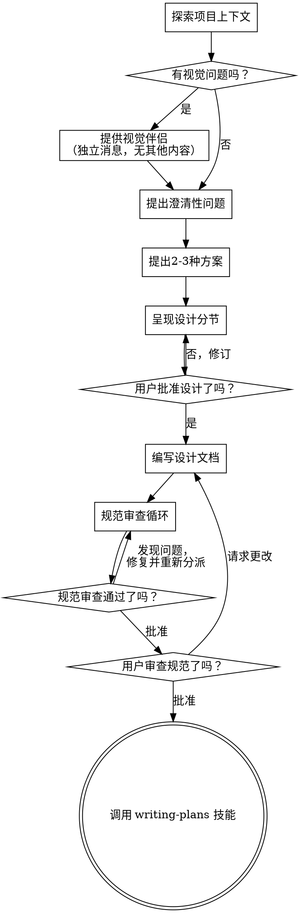

# 头脑风暴：将想法转化为设计

通过自然的协作对话，将想法转化为完整的设计和规范文档。

首先了解当前项目的上下文，然后一次提出一个问题来逐步完善想法。一旦你理解了要构建的内容，呈现设计并获得用户批准。

<HARD-GATE>
在你没有呈现设计并获得用户批准之前，不要调用任何实现技能、不要编写任何代码、不要搭建任何项目、或采取任何实现行动。这适用于所有项目，无论其看起来多么简单。
</HARD-GATE>

## 反面模式："这太简单了，不需要设计"

每个项目都需要经过这个流程。待办事项列表、单一功能工具、配置更改——所有这些都需要。"简单"项目正是未经审视的假设造成最多浪费工作的地方。设计可以很短（真正简单的项目几句话就够），但你必须呈现它并获得批准。

## 检查清单

你必须为以下每个项目创建任务，并按顺序完成：

1. **探索项目上下文** — 检查文件、文档、最近的提交
2. **提供视觉伴侣**（如果主题涉及视觉问题）— 这是独立的消息，不能与澄清问题合并。参见下面的视觉伴侣部分。
3. **提出澄清性问题** — 一次一个，理解目的/约束/成功标准
4. **提出2-3种方案** — 包含权衡和你推荐的建议
5. **呈现设计** — 按复杂度分节呈现，每节后获得用户批准
6. **编写设计文档** — 保存到 `docs/superpowers/specs/YYYY-MM-DD-<topic>-design.md` 并提交
7. **规范审查循环** — 使用精确制作的审查上下文分派 spec-document-reviewer 子代理（绝不能用你的会话历史）；修复问题并重新分派直到获得批准（最多3次迭代，然后提交给人工）
8. **用户审查书面规范** — 要求用户在继续之前审查规范文件
9. **过渡到实现** — 调用 writing-plans 技能创建实现计划

## 流程图

**最终状态是调用 writing-plans。** 不要调用 frontend-design、mcp-builder 或任何其他实现技能。头脑风暴之后你唯一调用的技能是 writing-plans。

## 流程说明

**理解想法：**

- 首先查看当前项目状态（文件、文档、最近的提交）
- 在提出详细问题之前，先评估范围：如果请求描述了多个独立的子系统（例如"构建一个包含聊天、文件存储、计费和分析的平台"），立即标记这一点。不要在需要首先分解的项目上花时间完善细节。
- 如果项目太大无法包含在单个规范中，帮助用户分解为子项目：有哪些独立的部分，它们如何关联，应该按什么顺序构建？然后通过正常的设计流程头脑风暴第一个子项目。每个子项目都有自己的规范 → 计划 → 实现周期。
- 对于规模适当的项目，一次提出一个问题来完善想法
- 尽可能使用选择题，但开放式问题也可以
- 每条消息只问一个问题——如果一个主题需要更多探索，将其分解为多个问题
- 专注于理解：目的、约束、成功标准

**探索方案：**

- 提出2-3种不同的方案及其权衡
- 以对话方式呈现选项，说明你的建议和理由
- 首先提出你推荐的选项并解释原因

**呈现设计：**

- 一旦你相信理解了要构建的内容，就呈现设计
- 根据每节的复杂度调整篇幅：简单的几句话，复杂的最多200-300字
- 每节后询问是否看起来正确
- 涵盖：架构、组件、数据流、错误处理、测试
- 准备好在内容不合理时返回澄清

**隔离和清晰设计：**

- 将系统分解为更小的单元，每个单元有一个明确的目的，通过定义良好的接口通信，可以独立理解和测试
- 对于每个单元，你应该能够回答：它做什么，你怎么使用它，它依赖什么？
- 有人能够在不阅读内部实现的情况下理解一个单元做什么吗？你能够在不破坏消费者的情况下更改内部实现吗？如果不能，边界需要改进。
- 更小、边界更好的单元也更容易处理——你能够更好地推理可以放在上下文中的代码，当文件专注于单一职责时，你的编辑更可靠。当一个文件变得很大时，这通常是一个信号，表明它做得太多了。

**在现有代码库中工作：**

- 在提出更改之前先探索当前结构。遵循现有模式。
- 如果现有代码有问题影响工作（例如，一个变得太大的文件、不清晰的边界、混乱的职责），将针对性的改进作为设计的一部分包含进来——就像一个优秀的开发人员在工作时改进代码一样。
- 不要提出无关的重构。专注于当前目标。

## 设计之后

**文档：**

- 将验证过的设计（规范）写入 `docs/superpowers/specs/YYYY-MM-DD-<topic>-design.md`
  - （用户对规范位置的偏好优先于此默认位置）
- 如果有 elements-of-style:writing-clearly-and-concisely 技能，请使用它
- 将设计文档提交到 git

**规范审查循环：**
编写规范文档后：

1. 分派 spec-document-reviewer 子代理（参见 spec-document-reviewer-prompt.md）
2. 如果发现问题：修复、重新分派、重复直到批准
3. 如果循环超过3次迭代，提交给人工指导

**用户审查门槛：**
规范审查循环通过后，在继续之前要求用户审查书面规范：

> "规范已编写并提交到 `<path>`。请审查它，如果你想做任何更改，请告诉我，然后我们再开始编写实现计划。"

等待用户的回应。如果他们请求更改，进行更改并重新运行规范审查循环。只有在用户批准后才能继续。

**实现：**

- 调用 writing-plans 技能创建详细的实现计划
- 不要调用任何其他技能。writing-plans 是下一步。

## 关键原则

- **一次一个问题** — 不要用多个问题淹没用户
- **优先选择题** — 尽可能比开放式问题更容易回答
- **严格遵循 YAGNI** — 从所有设计中移除不必要的功能
- **探索替代方案** — 在确定之前总是提出2-3种方案
- **增量验证** — 呈现设计，获得批准后再继续
- **保持灵活** — 当内容不合理时返回澄清

## 视觉伴侣

一个基于浏览器的伴侣，用于在头脑风暴期间显示模拟图、图表和视觉选项。作为工具提供——不是一种模式。接受伴侣意味着它可以用于从视觉处理中受益的问题；这并不意味着每个问题都要通过浏览器。

**提供伴侣：** 当你预计即将出现的问题涉及视觉内容（模拟图、布局、图表）时，提供一次以获得同意：
> "我们正在做的一些内容如果我能在网页浏览器中展示给你，可能会更容易解释。我可以随着进度整理模拟图、图表、比较和其他视觉效果。这个功能还是新的，可能比较消耗 token。想试试吗？（需要打开一个本地 URL）"

**这个提供必须是她自己的消息。** 不要将其与澄清问题、上下文摘要或任何其他内容合并。消息应该只包含上面的提供内容，不要有其他内容。在继续之前等待用户的回应。如果他们拒绝，继续纯文本头脑风暴。

**每个问题决策：** 即使用户接受了，也要为每个问题决定是否使用浏览器或终端。判断标准是：**用户通过看到它比阅读它能更好地理解吗？**

- **使用浏览器** 用于本身就是视觉的内容 — 模拟图、线框图、布局比较、架构图、并行视觉设计
- **使用终端** 用于文本内容 — 需求问题、概念选择、权衡列表、A/B/C/D 文本选项、范围决策

关于 UI 主题的问题并不自动就是视觉问题。"在这个上下文中个性意味着什么？"是一个概念问题 — 使用终端。"哪个向导布局更好？"是一个视觉问题 — 使用浏览器。

如果他们同意伴侣，在继续之前阅读详细指南：
`skills/brainstorming/visual-companion.md`
