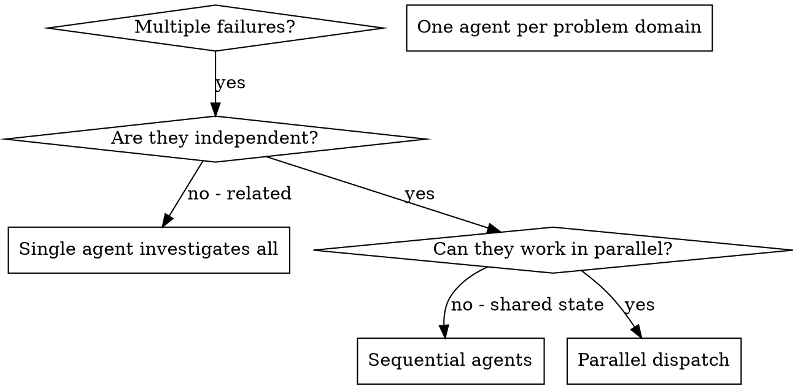

# 分发并行代理

## 概述

你将任务委托给具有隔离上下文的专用代理。通过精确设计它们的指令和上下文，你可以确保它们保持专注并成功完成任务。它们不应该继承你的会话上下文或历史——你需要精确构建它们所需的内容。这也保持了你自己用于协调工作的上下文。

当你有多个不相关的失败时（不同的测试文件、不同的子系统、不同的bug），按顺序调查它们会浪费时间。每项调查都是独立的，可以并行进行。

**核心原则：** 每个独立问题域分发一个代理。让它们并发工作。

## 何时使用



**使用场景：**
- 3个或更多测试文件失败，且有不同的根本原因
- 多个子系统独立损坏
- 每个问题可以在不需要其他问题上下文的情况下理解
- 调查之间没有共享状态

**不使用场景：**
- 失败是相关的（修复一个可能会修复其他）
- 需要了解完整的系统状态
- 代理会互相干扰

## 模式

### 1. 识别独立域

按损坏内容对失败进行分组：
- 文件A测试：工具审批流程
- 文件B测试：批量完成行为
- 文件C测试：中止功能

每个域都是独立的——修复工具审批不会影响中止测试。

### 2. 创建专注的代理任务

每个代理获得：
- **特定范围：** 一个测试文件或子系统
- **明确目标：** 让这些测试通过
- **约束：** 不要更改其他代码
- **预期输出：** 你发现和修复的内容摘要

### 3. 并行分发

```typescript
// 在 Claude Code / AI 环境中
Task("修复 agent-tool-abort.test.ts 失败")
Task("修复 batch-completion-behavior.test.ts 失败")
Task("修复 tool-approval-race-conditions.test.ts 失败")
// 所有三个并发运行
```

### 4. 审查和整合

当代理返回时：
- 阅读每个摘要
- 验证修复不冲突
- 运行完整测试套件
- 整合所有更改

## 代理提示结构

好的代理提示：
1. **专注** - 一个清晰的问题域
2. **自包含** - 理解问题所需的所有上下文
3. **输出具体** - 代理应该返回什么？

```markdown
修复 src/agents/agent-tool-abort.test.ts 中3个失败的测试：

1. "should abort tool with partial output capture" - 期望消息中包含 'interrupted at'
2. "should handle mixed completed and aborted tools" - 快速工具被中止而不是完成
3. "should properly track pendingToolCount" - 期望3个结果但得到0

这些是时序/竞态条件问题。你的任务：

1. 阅读测试文件，理解每个测试验证的内容
2. 找出根本原因——是时序问题还是实际bug？
3. 修复方式：
   - 用基于事件的等待替换任意超时
   - 如果发现bug则修复中止实现
   - 如果测试改变了行为则调整测试期望

不要只是增加超时——找出真正的问题。

返回：你发现的内容和你修复的内容的摘要。
```

## 常见错误

**错误做法：** "修复所有测试" - 代理会迷失
**正确做法：** "修复 agent-tool-abort.test.ts" - 范围专注

**错误做法：** "修复竞态条件" - 代理不知道在哪里
**正确做法：** 提供错误消息和测试名称的上下文

**错误做法：** 没有约束 - 代理可能会重构一切
**正确做法：** "不要更改生产代码" 或 "只修复测试"

**错误做法：** 模糊输出："修复它" - 你不知道改变了什么
**正确做法：** 具体说明："返回根本原因和更改的摘要"

## 何时不使用

**相关失败：** 修复一个可能会修复其他——先一起调查
**需要完整上下文：** 理解需要查看整个系统
**探索性调试：** 你还不知道哪里坏了
**共享状态：** 代理会互相干扰（编辑相同文件，使用相同资源）

## 真实案例

**场景：** 重大重构后，6个测试失败，分布在3个文件中

**失败：**
- agent-tool-abort.test.ts：3个失败（时序问题）
- batch-completion-behavior.test.ts：2个失败（工具未执行）
- tool-approval-race-conditions.test.ts：1个失败（执行计数 = 0）

**决策：** 独立域——中止逻辑与批量完成分离，与竞态条件分离

**分发：**
```
代理 1 → 修复 agent-tool-abort.test.ts
代理 2 → 修复 batch-completion-behavior.test.ts
代理 3 → 修复 tool-approval-race-conditions.test.ts
```

**结果：**
- 代理 1：用基于事件的等待替换了超时
- 代理 2：修复了事件结构bug（threadId位置错误）
- 代理 3：添加了等待异步工具执行完成

**整合：** 所有修复独立，无冲突，完整套件通过

**节省时间：** 3个问题并行解决 vs 顺序解决

## 关键优势

1. **并行化** - 多个调查同时进行
2. **专注** - 每个代理范围窄，需要跟踪的上下文更少
3. **独立性** - 代理之间不会互相干扰
4. **速度** - 用1个问题的时间解决3个问题

## 验证

代理返回后：
1. **审查每个摘要** - 理解改变了什么
2. **检查冲突** - 代理是否编辑了相同的代码？
3. **运行完整套件** - 验证所有修复一起工作
4. **抽查** - 代理可能犯系统性错误

## 实际影响

来自调试会话（2025-10-03）：
- 3个文件中的6个失败
- 3个代理并行分发
- 所有调查并发完成
- 所有修复成功整合
- 代理更改之间零冲突
