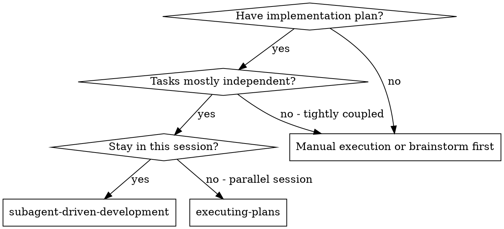
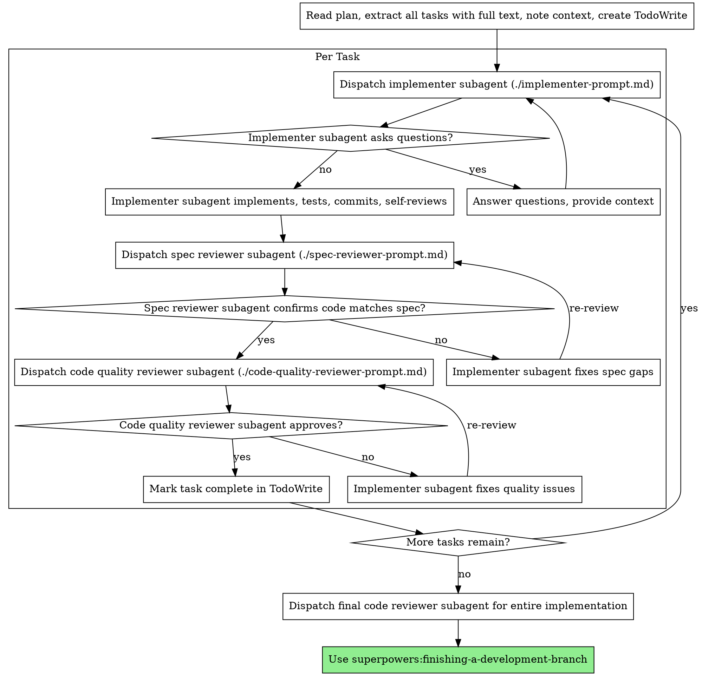

# 子代理驱动开发

通过为每个任务分发新的子代理来执行计划，并在每个任务后进行两阶段审查：首先进行规范合规审查，然后进行代码质量审查。

**为什么使用子代理：** 你将任务委托给具有隔离上下文的专用代理。通过精确设计它们的指令和上下文，你可以确保它们保持专注并成功完成任务。它们不应该继承你的会话上下文或历史——你需要精确构建它们所需的内容。这也保持了你自己用于协调工作的上下文。

**核心原则：** 每个任务一个新子代理 + 两阶段审查（先规范后质量）= 高质量、快速迭代

## 何时使用



**vs. Executing Plans（并行会话）：**
- 同一会话（无上下文切换）
- 每个任务一个新子代理（无上下文污染）
- 每个任务后两阶段审查：先规范合规，后代码质量
- 更快迭代（任务之间无需人工介入）

## 流程



## 模型选择

使用能处理该角色且功能最弱的模型，以节省成本并提高速度。

**机械实现任务**（孤立函数、清晰规范、1-2个文件）：使用快速、便宜的模型。当计划详细指定时，大多数实现任务是机械性的。

**集成和判断任务**（多文件协调、模式匹配、调试）：使用标准模型。

**架构、设计和审查任务**：使用能力最强的可用模型。

**任务复杂性信号：**
- 触及 1-2 个文件，有完整规范 → 便宜模型
- 触及多个文件，有集成问题 → 标准模型
- 需要设计判断或广泛的代码库理解 → 能力最强的模型

## 处理实现者状态

实现者子代理报告四种状态之一。相应处理：

**DONE：** 继续规范合规审查。

**DONE_WITH_CONCERNS：** 实现者完成了工作但标记了疑虑。在继续前阅读这些顾虑。如果顾虑关于正确性或范围，先解决它们。如果它们是观察（例如"这个文件变得很大"），记录下来并继续审查。

**NEEDS_CONTEXT：** 实现者需要未提供的信息。提供缺失的上下文并重新分发。

**BLOCKED：** 实现者无法完成任务。评估阻塞原因：
1. 如果是上下文问题，提供更多上下文并用相同模型重新分发
2. 如果任务需要更多推理，用能力更强的模型重新分发
3. 如果任务太大，将其分解为更小的部分
4. 如果计划本身有问题，升级给人类

**永远不要**忽略升级或不做更改就让相同模型重试。如果实现者说卡住了，需要改变某些东西。

## 提示模板

- `./implementer-prompt.md` - 分发实现者子代理
- `./spec-reviewer-prompt.md` - 分发规范合规审查者子代理
- `./code-quality-reviewer-prompt.md` - 分发代码质量审查者子代理

## 示例工作流

```
你：我正在使用 Subagent-Driven Development 来执行这个计划。

[阅读计划文件一次：docs/superpowers/plans/feature-plan.md]
[提取所有5个任务的完整文本和上下文]
[创建包含所有任务的 TodoWrite]

任务 1：挂钩安装脚本

[获取任务 1 文本和上下文（已提取）]
[用完整任务文本 + 上下文分发实现子代理]

实现者："在我开始之前——挂钩应该安装在用户级别还是系统级别？"

你："用户级别（~/.config/superpowers/hooks/）"

实现者："明白了。正在实现..."
[稍后] 实现者：
  - 实现了 install-hook 命令
  - 添加了测试，5/5 通过
  - 自我审查：发现遗漏了 --force 标志，已添加
  - 已提交

[分发规范合规审查者]
规范审查者：✅ 符合规范 - 所有需求满足，没有额外内容

[获取 git SHA，分发代码质量审查者]
代码审查者：优点：测试覆盖好，干净。问题：无。批准。

[标记任务 1 完成]

任务 2：恢复模式

[获取任务 2 文本和上下文（已提取）]
[用完整任务文本 + 上下文分发实现子代理]

实现者：[没有问题，继续]
实现者：
  - 添加了 verify/repair 模式
  - 8/8 测试通过
  - 自我审查：都很好
  - 已提交

[分发规范合规审查者]
规范审查者：❌ 问题：
  - 缺失：进度报告（规范说"每 100 个项目报告"）
  - 额外：添加了 --json 标志（未请求）

[实现者修复问题]
实现者：移除了 --json 标志，添加了进度报告

[规范审查者再次审查]
规范审查者：✅ 现在符合规范

[分发代码质量审查者]
代码审查者：优点：扎实。问题（重要）：魔法数字 (100)

[实现者修复]
实现者：提取了 PROGRESS_INTERVAL 常量

[代码审查者再次审查]
代码审查者：✅ 批准

[标记任务 2 完成]

...

[所有任务后]
[分发最终代码审查者]
最终审查者：所有需求满足，可以合并

完成！
```

## 优势

**vs. 手动执行：**
- 子代理自然遵循 TDD
- 每个任务全新上下文（无混淆）
- 并行安全（子代理不干扰）
- 子代理可以提问（工作前和工作期间都可以）

**vs. Executing Plans：**
- 同一会话（无交接）
- 持续进度（无需等待）
- 审查检查点自动

**效率提升：**
- 无文件读取开销（控制器提供完整文本）
- 控制器精确策划需要的上下文
- 子代理提前获得完整信息
- 问题在工作开始前浮出水面（不是之后）

**质量门禁：**
- 自我审查在交接前捕获问题
- 两阶段审查：规范合规，然后代码质量
- 审查循环确保修复实际有效
- 规范合规防止过度/不足构建
- 代码质量确保实现构建良好

**成本：**
- 更多子代理调用（每个任务实现者 + 2 个审查者）
- 控制器做更多准备工作（提前提取所有任务）
- 审查循环增加迭代
- 但尽早捕获问题（比后期调试便宜）

## 红旗

**永远不要：**
- 未经用户明确同意在 main/master 分支上开始实现
- 跳过审查（规范合规或代码质量）
- 在问题未修复时继续
- 并行分发多个实现子代理（冲突）
- 让子代理阅读计划文件（而是提供完整文本）
- 跳过场景设置上下文（子代理需要理解任务在哪里）
- 忽略子代理问题（在让他们继续前回答）
- 接受"差不多"的规范合规（规范审查者发现问题 = 未完成）
- 跳过审查循环（审查者发现问题 = 实现者修复 = 再次审查）
- 让实现者自我审查取代实际审查（两者都需要）
- **在规范合规 ✅ 前开始代码质量审查**（顺序错误）
- 当任一审查有未解决问题时转到下一个任务

**如果子代理提问：**
- 清晰完整地回答
- 如需要提供额外上下文
- 不要催促他们实现

**如果审查者发现问题：**
- 实现者（相同子代理）修复它们
- 审查者再次审查
- 重复直到批准
- 不要跳过重新审查

**如果子代理任务失败：**
- 用具体指令分发修复子代理
- 不要尝试手动修复（上下文污染）

## 集成

**必需的工作流技能：**
- **superpowers:using-git-worktrees** - 必需：在开始前设置隔离工作区
- **superpowers:writing-plans** - 创建此技能执行的计划
- **superpowers:requesting-code-review** - 审查者子代理的代码审查模板
- **superpowers:finishing-a-development-branch** - 所有任务完成后完成开发

**子代理应使用：**
- **superpowers:test-driven-development** - 子代理每个任务遵循 TDD

**替代工作流：**
- **superpowers:executing-plans** - 用于并行会话而不是同一会话执行
