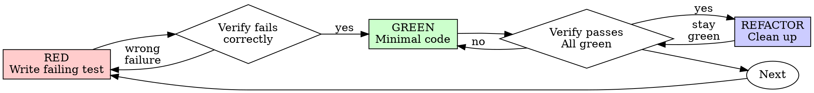

# Test-Driven Development (TDD) 测试驱动开发

## 概述

先写测试。观察它失败。写最少的代码使其通过。

**核心原则：** 如果你没有观察到测试失败，你就不知道它是否测试了正确的内容。

**违反规则的字面意思就是违反规则的精神。**

## 何时使用

**始终使用：**
- 新功能
- Bug 修复
- 重构
- 行为变更

**例外（咨询你的伙伴）：**
- 一次性原型
- 生成的代码
- 配置文件

想"这次跳过 TDD"？停手。这是在自我合理化。

## 铁律

```
没有失败的测试就不能写生产代码
```

在测试之前写代码？删除它。重新开始。

**无例外：**
- 不要把它作为"参考"保留
- 不要在写测试时"适应"它
- 不要看它
- 删除就是删除

从测试重新开始实现。就这样。

## 红-绿-重构



### RED - 写失败的测试

写一个最小的测试，展示应该发生什么。

<Good>
```typescript
test('retries failed operations 3 times', async () => {
  let attempts = 0;
  const operation = () => {
    attempts++;
    if (attempts < 3) throw new Error('fail');
    return 'success';
  };

  const result = await retryOperation(operation);

  expect(result).toBe('success');
  expect(attempts).toBe(3);
});
```
名称清晰，测试真实行为，一件事
</Good>

<Bad>
```typescript
test('retry works', async () => {
  const mock = jest.fn()
    .mockRejectedValueOnce(new Error())
    .mockRejectedValueOnce(new Error())
    .mockResolvedValueOnce('success');
  await retryOperation(mock);
  expect(mock).toHaveBeenCalledTimes(3);
});
```
名称模糊，测试 mock 而非代码
</Bad>

**要求：**
- 一个行为
- 清晰的名称
- 真实代码（除非不可避免，否则不使用 mocks）

### 验证 RED - 观察它失败

**强制执行。永不跳过。**

```bash
npm test path/to/test.test.ts
```

确认：
- 测试失败（不是错误）
- 失败消息符合预期
- 因为功能缺失而失败（不是拼写错误）

**测试通过了？** 你在测试已有行为。修复测试。

**测试出错了？** 修复错误，重新运行直到它正确失败。

### GREEN - 最少代码

写最简单的代码使测试通过。

<Good>
```typescript
async function retryOperation<T>(fn: () => Promise<T>): Promise<T> {
  for (let i = 0; i < 3; i++) {
    try {
      return await fn();
    } catch (e) {
      if (i === 2) throw e;
    }
  }
  throw new Error('unreachable');
}
```
刚好够通过
</Good>

<Bad>
```typescript
async function retryOperation<T>(
  fn: () => Promise<T>,
  options?: {
    maxRetries?: number;
    backoff?: 'linear' | 'exponential';
    onRetry?: (attempt: number) => void;
  }
): Promise<T> {
  // YAGNI
}
```
过度设计
</Bad>

不要添加功能，不要重构其他代码，也不要在测试要求之外"改进"。

### 验证 GREEN - 观察它通过

**强制执行。**

```bash
npm test path/to/test.test.ts
```

确认：
- 测试通过
- 其他测试仍然通过
- 输出干净（无错误、无警告）

**测试失败了？** 修复代码，而非测试。

**其他测试失败了？** 立即修复。

### REFACTOR - 清理

只在 green 之后：
- 消除重复
- 改进名称
- 提取辅助函数

保持测试 green。不要添加行为。

### 重复

下一个功能的下一个失败测试。

## 好测试

| 质量 | 好 | 差 |
|---------|------|-----|
| **最小化** | 一件事。名称中有"and"？拆分它。 | `test('validates email and domain and whitespace')` |
| **清晰** | 名称描述行为 | `test('test1')` |
| **展示意图** | 展示期望的 API | 掩盖代码应该做什么 |

## 为什么顺序重要

**"我之后再写测试来验证它工作"**

代码之后写的测试会立即通过。立即通过什么都证明不了：
- 可能测试了错误的东西
- 可能测试了实现，而非行为
- 可能遗漏了你忘记的边界情况
- 你从未见过它捕获 bug

测试优先强迫你看到测试失败，证明它确实测试了某些东西。

**"我已经手动测试了所有边界情况"**

手动测试是随机的。你以为测试了一切，但：
- 没有记录你测试了什么
- 代码变更时无法重新运行
- 在压力下容易忘记情况
- "我试的时候它工作了" ≠ 全面

自动化测试是系统性的。它们每次都以相同方式运行。

**"删除 X 小时的工作是浪费的"**

沉没成本谬误。时间已经过去了。你现在的选择：
- 删除并用 TDD 重写（X 更多小时，高置信度）
- 保留它并稍后添加测试（30 分钟，低置信度，可能有 bug）

"浪费"是保留你无法信任的代码。没有真正测试的工作代码是技术债务。

**"TDD 是教条的，务实意味着适应"**

TDD 是务实的：
- 在提交前发现 bug（比之后调试更快）
- 防止回归（测试立即捕获破坏）
- 文档化行为（测试展示如何使用代码）
- 支持重构（自由更改，测试捕获破坏）

"务实"捷径 = 在生产中调试 = 更慢。

**"之后测试达到相同目标 - 这是精神而非仪式"**

不对。之后的测试回答"这是做什么的？"测试优先回答"这应该做什么？"

之后的测试受你的实现偏见影响。你测试你构建的，而不是需要的。你验证记住的边界情况，而不是发现的。

测试优先强迫在实现之前发现边界情况。之后测试验证你记住了一切（你没有）。

30 分钟的之后测试 ≠ TDD。你获得了覆盖率，但失去了测试工作的证明。

## 常见合理化

| 借口 | 现实 |
|--------|---------|
| "太简单不需要测试" | 简单代码也会坏。测试只需 30 秒。 |
| "我稍后测试" | 测试立即通过什么都证明不了。 |
| "之后测试达到相同目标" | 之后测试 = "这是做什么的？"测试优先 = "这应该做什么？" |
| "已经手动测试了" | 随机 ≠ 系统化。无记录，无法重新运行。 |
| "删除 X 小时是浪费的" | 沉没成本谬误。保留未验证的代码是技术债务。 |
| "作为参考保留，边写测试边改" | 你会适应它。这是在之后测试。删除就是删除。 |
| "需要先探索" | 可以。丢弃探索，从 TDD 开始。 |
| "测试难 = 设计不清" | 倾听测试。难测试 = 难使用。 |
| "TDD 会拖慢我" | TDD 比调试快。务实 = 测试优先。 |
| "手动测试更快" | 手动不能证明边界情况。每次更改你都会重新测试。 |
| "现有代码没有测试" | 你在改进它。为现有代码添加测试。 |

## 红旗 - 停止并重新开始

- 代码在测试之前
- 测试在实现之后
- 测试立即通过
- 无法解释为什么测试失败
- 稍后添加的测试
- 合理化"就这一次"
- "我已经手动测试了"
- "之后测试达到相同目的"
- "这是关于精神而非仪式"
- "作为参考保留"或"适应现有代码"
- "已经花了 X 小时，删除是浪费的"
- "TDD 是教条的，我很务实"
- "这是不同的因为..."

**所有这些意味着：删除代码。用 TDD 重新开始。**

## 示例：Bug 修复

**Bug：** 空的 email 被接受

**RED**
```typescript
test('rejects empty email', async () => {
  const result = await submitForm({ email: '' });
  expect(result.error).toBe('Email required');
});
```

**验证 RED**
```bash
$ npm test
FAIL: expected 'Email required', got undefined
```

**GREEN**
```typescript
function submitForm(data: FormData) {
  if (!data.email?.trim()) {
    return { error: 'Email required' };
  }
  // ...
}
```

**验证 GREEN**
```bash
$ npm test
PASS
```

**REFACTOR**
如有需要，提取多个字段的验证。

## 验证清单

在标记工作完成之前：

- [ ] 每个新函数/方法都有测试
- [ ] 在实现之前观察每个测试失败
- [ ] 每个测试失败原因符合预期（功能缺失，不是拼写错误）
- [ ] 写了最少的代码使每个测试通过
- [ ] 所有测试通过
- [ ] 输出干净（无错误、无警告）
- [ ] 测试使用真实代码（除非不可避免，否则不使用 mocks）
- [ ] 覆盖了边界情况和错误

不能勾选所有框？你跳过了 TDD。重新开始。

## 当卡住时

| 问题 | 解决方案 |
|---------|----------|
| 不知道如何测试 | 写你期望的 API。先写断言。咨询你的伙伴。 |
| 测试太复杂 | 设计太复杂。简化接口。 |
| 必须 mock 一切 | 代码太耦合。使用依赖注入。 |
| 测试设置巨大 | 提取辅助函数。还是复杂？简化设计。 |

## 调试集成

发现 bug？写一个重现它的失败测试。遵循 TDD 周期。测试证明修复并防止回归。

永远不要在没有测试的情况下修复 bug。

## 测试反模式

添加 mocks 或测试工具时，阅读 @testing-anti-patterns.md 以避免常见陷阱：
- 测试 mock 行为而非真实行为
- 向生产类添加仅测试的方法
- 不理解依赖就 mock

## 最终规则

```
生产代码 → 测试存在且先失败
否则 → 不是 TDD
```

未经你的伙伴许可，无例外。
