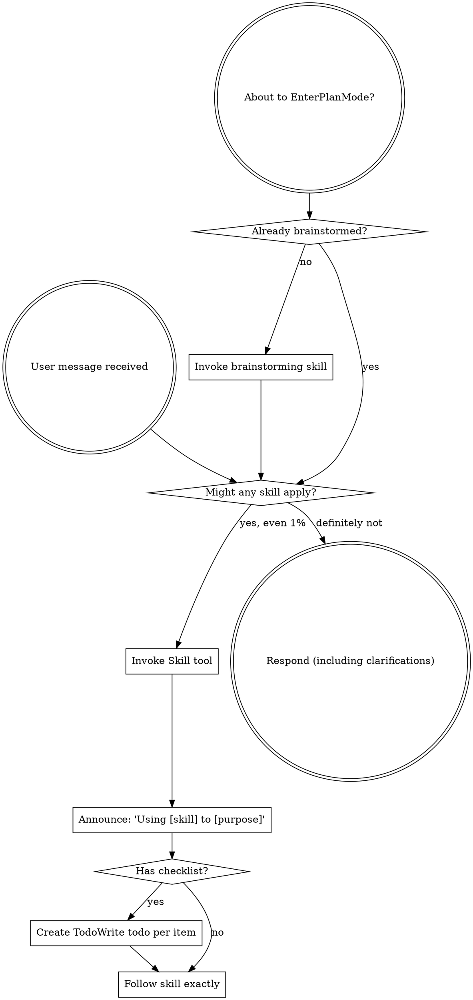

<SUBAGENT-STOP>
If you were dispatched as a subagent to execute a specific task, skip this skill.
</SUBAGENT-STOP>

<EXTREMELY-IMPORTANT>
If you think there is even a 1% chance a skill might apply to what you are doing, you ABSOLUTELY MUST invoke the skill.

IF A SKILL APPLIES TO YOUR TASK, YOU DO NOT HAVE A CHOICE. YOU MUST USE IT.

This is not negotiable. This is not optional. You cannot rationalize your way out of this.
</EXTREMELY-IMPORTANT>

## Instruction Priority 指令优先级

Superpowers skills override default system prompt behavior, but **user instructions always take precedence**:

超级powers skills 覆盖默认系统提示行为，但**用户指令始终优先**：

1. **User's explicit instructions** (CLAUDE.md, GEMINI.md, AGENTS.md, direct requests) — highest priority
   **用户的明确指令** (CLAUDE.md, GEMINI.md, AGENTS.md, 直接请求) — 最高优先级
2. **Superpowers skills** — override default system behavior where they conflict
   **超级powers skills** — 在冲突处覆盖默认系统行为
3. **Default system prompt** — lowest priority
   **默认系统提示** — 最低优先级

If CLAUDE.md, GEMINI.md, or AGENTS.md says "don't use TDD" and a skill says "always use TDD," follow the user's instructions. The user is in control.
如果 CLAUDE.md、GEMINI.md 或 AGENTS.md 说"不要使用 TDD"而 skill 说"始终使用 TDD"，请遵循用户的指令。用户说了算。

## How to Access Skills 如何访问 Skills

**In Claude Code:** Use the `Skill` tool. When you invoke a skill, its content is loaded and presented to you—follow it directly. Never use the Read tool on skill files.
**在 Claude Code 中：** 使用 `Skill` 工具。当调用 skill 时，其内容被加载并呈现给你——直接遵循它。永远不要用 Read 工具读取 skill 文件。

**In Gemini CLI:** Skills activate via the `activate_skill` tool. Gemini loads skill metadata at session start and activates the full content on demand.
**在 Gemini CLI 中：** Skills 通过 `activate_skill` 工具激活。Gemini 在会话开始时加载 skill 元数据并按需激活完整内容。

**In other environments:** Check your platform's documentation for how skills are loaded.
**在其他环境中：** 检查你的平台文档了解如何加载 skills。

## Platform Adaptation 平台适配

Skills use Claude Code tool names. Non-CC platforms: see `references/codex-tools.md` (Codex) for tool equivalents. Gemini CLI users get the tool mapping loaded automatically via GEMINI.md.
Skills 使用 Claude Code 工具名称。非 CC 平台：参见 `references/codex-tools.md` (Codex) 的工具等价物。Gemini CLI 用户通过 GEMINI.md 自动加载工具映射。

# Using Skills 使用 Skills

## The Rule 规则

**Invoke relevant or requested skills BEFORE any response or action.** Even a 1% chance a skill might apply means that you should invoke the skill to check. If an invoked skill turns out to be wrong for the situation, you don't need to use it.
**在任何响应或操作之前调用相关或请求的 skills。** 即使有 1% 的可能性 skill 可能适用，你也应该调用 skill 来检查。如果调用的 skill 原来是错误的情况，你不需要使用它。

## Red Flags 红旗

These thoughts mean STOP—you're rationalizing:
这些想法意味着停止——你在合理化：

| Thought 想法 | Reality 现实 |
|---------|---------|
| "This is just a simple question" | Questions are tasks. Check for skills. 问题就是任务。检查 skills。 |
| "I need more context first" | Skill check comes BEFORE clarifying questions. Skill 检查在澄清问题之前。 |
| "Let me explore the codebase first" | Skills tell you HOW to explore. Check first. Skills 告诉你如何探索。先检查。 |
| "I can check git/files quickly" | Files lack conversation context. Check for skills. 文件缺少对话上下文。检查 skills。 |
| "Let me gather information first" | Skills tell you HOW to gather information. Skills 告诉你如何收集信息。 |
| "This doesn't need a formal skill" | If a skill exists, use it. 如果 skill 存在，使用它。 |
| "I remember this skill" | Skills evolve. Read current version. Skills 是演进的。阅读当前版本。 |
| "This doesn't count as a task" | Action = task. Check for skills. 行动 = 任务。检查 skills。 |
| "The skill is overkill" | Simple things become complex. Use it. 简单的事会变复杂。使用它。 |
| "I'll just do this one thing first" | Check BEFORE doing anything. 在做任何事之前检查。 |
| "This feels productive" | Undisciplined action wastes time. Skills prevent this. 无纪律的行动浪费时间。Skills 防止这个。 |
| "I know what that means" | Knowing the concept ≠ using the skill. Invoke it. 知道概念 ≠ 使用 skill。调用它。 |

## Skill Priority Skill 优先级

When multiple skills could apply, use this order:
当多个 skills 可能适用时，使用此顺序：

1. **Process skills first** (brainstorming, debugging) - these determine HOW to approach the task
   **流程 skills 优先**（brainstorming、debugging）- 这些决定如何处理任务
2. **Implementation skills second** (frontend-design, mcp-builder) - these guide execution
   **实施 skills 第二**（frontend-design、mcp-builder）- 这些指导执行

"Let's build X" → brainstorming first, then implementation skills.
"让我们构建 X" → 先 brainstorming，然后实施 skills。
"Fix this bug" → debugging first, then domain-specific skills.
"修复这个 bug" → 先 debugging，然后领域特定 skills。

## Skill Types Skill 类型

**Rigid** (TDD, debugging): Follow exactly. Don't adapt away discipline.
**严格型**（TDD、debugging）：严格遵循。不要为了适应而丢掉纪律。

**Flexible** (patterns): Adapt principles to context.
**灵活型**（patterns）：根据上下文调整原则。

The skill itself tells you which.
skill 本身会告诉你它是哪种。

## User Instructions 用户指令

Instructions say WHAT, not HOW. "Add X" or "Fix Y" doesn't mean skip workflows.
指令说明是什么，而不是怎么做。"添加 X"或"修复 Y"不意味着跳过工作流程。
