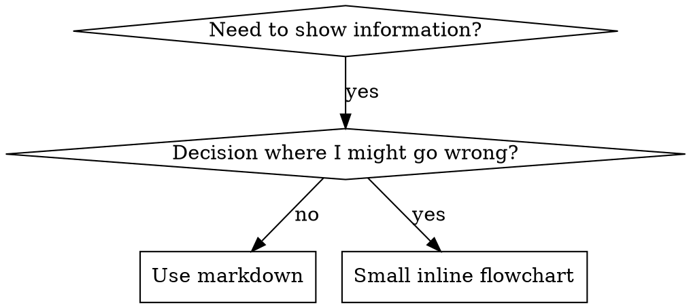

# Writing Skills 编写 Skills

## 概述

**编写 skills 就是将测试驱动开发应用于流程文档。**

**个人 skills 存在于特定于 agent 的目录中（`~/.claude/skills` 用于 Claude Code，`~/.agents/skills/` 用于 Codex）**

你写测试用例（带 subagent 的压力场景），观察它们失败（基线行为），写 skill（文档），观察测试通过（agents 遵守），然后重构（关闭漏洞）。

**核心原则：** 如果你没有观察 agent 在没有 skill 的情况下失败，你就不知道 skill 教的是正确的东西。

**必需背景：** 在使用此 skill 之前，你必须理解 superpowers:test-driven-development。该 skill 定义了基本的红-绿-重构周期。此 skill 将 TDD 适配到文档。

**官方指导：** 有关 Anthropic 官方 skill 编写最佳实践，请参见 anthropic-best-practices.md。本文档提供了补充此 skill 中以 TDD 为重点的方法的附加模式和指南。

## 什么是 Skill？

**skill** 是经过验证的技术、模式或工具的参考指南。Skills 帮助未来的 Claude 实例找到并应用有效方法。

**Skills 是：** 可重用技术、模式、工具、参考指南

**Skills 不是：** 关于你如何一次解决问题的叙事

## Skill 创作的 TDD 映射

| TDD 概念 | Skill 创作 |
|-------------|----------------|
| **测试用例** | 带 subagent 的压力场景 |
| **生产代码** | Skill 文档 (SKILL.md) |
| **测试失败（RED）** | Agent 在没有 skill 时违反规则（基线） |
| **测试通过（GREEN）** | Agent 在有 skill 时遵守 |
| **重构** | 在保持合规的同时关闭漏洞 |
| **先写测试** | 在写 skill 前运行基线场景 |
| **观察它失败** | 记录 agent 使用的确切合理化 |
| **最少代码** | 写解决这些特定违规的 skill |
| **观察它通过** | 验证 agent 现在遵守 |
| **重构周期** | 发现新合理化 → 堵住 → 重新验证 |

整个 skill 创作过程遵循红-绿-重构。

## 何时创建 Skill

**创建当：**
- 该技术对你来说不是直观明显的
- 你会在项目间参考这个
- 模式广泛适用（不是特定于项目的）
- 其他人会受益

**不要创建：**
- 一次性的解决方案
- 在其他地方有很好文档记录的标准实践
- 特定于项目的约定（放在 CLAUDE.md 中）
- 可以用正则/验证强制执行的机械约束（如果可以用自动化，节省文档用于判断调用）

## Skill 类型

### Technique 技术
具有要遵循的步骤的具体方法（condition-based-waiting, root-cause-tracing）

### Pattern 模式
思考问题的方式（flatten-with-flags, test-invariants）

### Reference 参考
API 文档、语法指南、工具文档（office docs）

## 目录结构


```
skills/
  skill-name/
    SKILL.md              # 主参考（必需）
    supporting-file.*     # 仅在需要时
```

**扁平命名空间** - 所有 skills 在一个可搜索的命名空间中

**单独文件用于：**
1. **重型参考**（100+ 行）- API 文档、全面的语法
2. **可重用工具** - 脚本、实用程序、模板

**保持内联：**
- 原则和概念
- 代码模式（< 50 行）
- 其他一切

## SKILL.md 结构

**Frontmatter (YAML)：**
- 只支持两个字段：`name` 和 `description`
- 最多 1024 字符
- `name`：只使用字母、数字和连字符（无括号、特殊字符）
- `description`：第三人称，只描述何时使用（不是它做什么）
  - 以"Use when..."开始以聚焦触发条件
  - 包含特定症状、情况和上下文
  - **永远不要总结 skill 的过程或工作流**（参见 CSO 部分了解原因）
  - 如果可能，保持在 500 字符以下

```markdown
---
name: Skill-Name-With-Hyphens
description: Use when [specific triggering conditions and symptoms]
---

# Skill Name

## Overview
What is this? Core principle in 1-2 sentences.

## When to Use
[Small inline flowchart IF decision non-obvious]

Bullet list with SYMPTOMS and use cases
When NOT to use

## Core Pattern (for techniques/patterns)
Before/after code comparison

## Quick Reference
Table or bullets for scanning common operations

## Implementation
Inline code for simple patterns
Link to file for heavy reference or reusable tools

## Common Mistakes
What goes wrong + fixes

## Real-World Impact (optional)
Concrete results
```


## Claude Search Optimization (CSO) Claude 搜索优化

**发现的关键：** 未来的 Claude 需要找到你的 skill

### 1. 丰富的描述字段

**目的：** Claude 读取描述来决定为给定任务加载哪些 skills。让它回答："我现在应该读这个 skill 吗？"

**格式：** 以"Use when..."开始以聚焦触发条件

**关键：Description = 何时使用，不是 Skill 做什么**

描述应该只描述触发条件。不要在描述中总结 skill 的过程或工作流。

**为什么这很重要：** 测试揭示当描述总结 skill 的工作流时，Claude 可能跟随描述而不是阅读完整的 skill 内容。说"code review between tasks"的描述导致 Claude 做一次审查，即使 skill 的 flowchart 清楚地显示两次审查（规范合规然后代码质量）。

当描述改为只是"Use when executing implementation plans with independent tasks"（没有工作流总结）时，Claude 正确阅读了 flowchart 并遵循了两阶段审查过程。

**陷阱：** 总结工作流的描述创建了 Claude 会走的捷径。Skill 主体成为 Claude 跳过的文档。

```yaml
# ❌ 错误：总结工作流 - Claude 可能跟随这个而不是阅读 skill
description: Use when executing plans - dispatches subagent per task with code review between tasks

# ❌ 错误：太多过程细节
description: Use for TDD - write test first, watch it fail, write minimal code, refactor

# ✅ 正确：只有触发条件，无工作流总结
description: Use when executing implementation plans with independent tasks in the current session

# ✅ 正确：只有触发条件
description: Use when implementing any feature or bugfix, before writing implementation code
```

**内容：**
- 使用具体的触发器、症状和表示此 skill 适用的情况
- 描述*问题*（竞态条件、不一致行为）而不是*语言特定症状*（setTimeout、sleep）
- 保持触发器技术 agnostic，除非 skill 本身是技术特定的
- 如果 skill 是技术特定的，在触发器中明确说明
- 用第三人称书写（注入系统提示）
- **永远不要总结 skill 的过程或工作流**

```yaml
# ❌ 错误：太抽象、太模糊，没有包含何时使用
description: For async testing

# ❌ 错误：第一人称
description: I can help you with async tests when they're flaky

# ❌ 错误：提到技术但 skill 不是特定于它的
description: Use when tests use setTimeout/sleep and are flaky

# ✅ 正确：以"Use when"开始，描述问题，无工作流
description: Use when tests have race conditions, timing dependencies, or pass/fail inconsistently

# ✅ 正确：技术特定 skill 有明确触发器
description: Use when using React Router and handling authentication redirects
```

### 2. 关键词覆盖

使用 Claude 会搜索的词：
- 错误消息："Hook timed out"、"ENOTEMPTY"、"race condition"
- 症状："flaky"、"hanging"、"zombie"、"pollution"
- 同义词："timeout/hang/freeze"、"cleanup/teardown/afterEach"
- 工具：实际命令、库名称、文件类型

### 3. 描述性命名

**使用主动语态，动词优先：**
- ✅ `creating-skills` 不是 `skill-creation`
- ✅ `condition-based-waiting` 不是 `async-test-helpers`

### 4. Token 效率（关键）

**问题：** getting-started 和频繁引用的 skills 加载到每个会话中。 每个 token 都很重要。

**目标字数：**
- getting-started 工作流：<150 词每个
- 频繁加载的 skills：<200 词总计
- 其他 skills：<500 词（仍然要简洁）

**技术：**

**将细节移到工具帮助：**
```bash
# ❌ 错误：在 SKILL.md 中记录所有标志
search-conversations 支持 --text、--both、--after DATE、--before DATE、--limit N

# ✅ 正确：参考 --help
search-conversations 支持多种模式和过滤器。运行 --help 获取详情。
```

**使用交叉引用：**
```markdown
# ❌ 错误：重复工作流细节
When searching, dispatch subagent with template...
[20 lines of repeated instructions]

# ✅ 正确：引用其他 skill
Always use subagents (50-100x context savings). REQUIRED: Use [other-skill-name] for workflow.
```

**压缩示例：**
```markdown
# ❌ 错误：冗长示例（42 词）
Partner: "How did we handle authentication errors in React Router before?"
You: I'll search past conversations for React Router authentication patterns.
[Dispatch subagent with search query: "React Router authentication error handling 401"]

# ✅ 正确：最小示例（20 词）
Partner: "How did we handle auth errors in React Router?"
You: Searching...
[Dispatch subagent → synthesis]
```

**消除冗余：**
- 不要重复交叉引用的 skills 中的内容
- 不要解释从命令中显而易见的内容
- 不要包含多个相同模式的示例

**验证：**
```bash
wc -w skills/path/SKILL.md
# getting-started 工作流：目标 <150 每个
# 其他频繁加载：目标 <200 总计
```

**按你做的或核心洞察命名：**
- ✅ `condition-based-waiting` > `async-test-helpers`
- ✅ `using-skills` 不是 `skill-usage`
- ✅ `flatten-with-flags` > `data-structure-refactoring`
- ✅ `root-cause-tracing` > `debugging-techniques`

**动名词（-ing）适合流程：**
- `creating-skills`、`testing-skills`、`debugging-with-logs`
- 主动，描述你正在采取的行动

### 4. 交叉引用其他 Skills

**编写引用其他 skills 的文档时：**

只使用 skill 名称，带明确的需求标记：
- ✅ 好：`**REQUIRED SUB-SKILL:** Use superpowers:test-driven-development`
- ✅ 好：`**REQUIRED BACKGROUND:** You MUST understand superpowers:systematic-debugging`
- ❌ 坏：`See skills/testing/test-driven-development`（不清楚是否必需）
- ❌ 坏：`@skills/testing/test-driven-development/SKILL.md`（强制加载，消耗上下文）

**为什么不用 @ 链接：** `@` 语法强制立即加载文件，在你需要之前消耗 200k+ 上下文。

## Flowchart Usage 流程图使用



**只对以下使用流程图：**
- 非显而易见的决策点
- 你可能过早停止的流程循环
- "何时用 A vs B"决策

**永远不要对以下使用流程图：**
- 参考材料 → 表格、列表
- 代码示例 → Markdown 块
- 线性指令 → 编号列表
- 没有语义意义的标签（step1、helper2）

参见 @graphviz-conventions.dot 获取 graphviz 样式规则。

**为你的伙伴可视化：** 使用此目录中的 `render-graphs.js` 将 skill 的流程图渲染为 SVG：
```bash
./render-graphs.js ../some-skill           # 每个图单独渲染
./render-graphs.js ../some-skill --combine # 所有图在一个 SVG 中
```

## Code Examples 代码示例

**一个出色的示例胜过许多平庸的示例**

选择最相关的语言：
- 测试技术 → TypeScript/JavaScript
- 系统调试 → Shell/Python
- 数据处理 → Python

**好的示例：**
- 完整且可运行
- 良好注释解释为什么
- 来自真实场景
- 清晰展示模式
- 准备适配（不是通用模板）

**不要：**
- 用 5+ 种语言实现
- 创建填空模板
- 写杜撰的示例

你擅长移植——一个出色的示例就足够了。

## File Organization 文件组织

### Self-Contained Skill 自包含 Skill
```
defense-in-depth/
  SKILL.md    # 一切都内联
```
当：所有内容适合，不需要重型参考

### Skill with Reusable Tool 带可重用工具的 Skill
```
condition-based-waiting/
  SKILL.md    # 概述 + 模式
  example.ts  # 可适配的工作辅助函数
```
当：工具是可重用代码，不只是叙事

### Skill with Heavy Reference 带重型参考的 Skill
```
pptx/
  SKILL.md       # 概述 + 工作流
  pptxgenjs.md   # 600 行 API 参考
  ooxml.md       # 500 行 XML 结构
  scripts/       # 可执行工具
```
当：参考材料太大无法内联

## 铁律（与 TDD 相同）

```
没有失败的测试就不能有 Skill
```

这适用于新 skills 和对现有 skills 的编辑。

在测试前写 skill？删除它。重新开始。
编辑 skill 而不测试？同样的违规。

**无例外：**
- 不是为了"简单添加"
- 不是为了"只是添加一个部分"
- 不是为了"文档更新"
- 不要保留未测试的更改作为"参考"
- 不要在运行测试时"适应"
- 删除就是删除

**必需背景：** superpowers:test-driven-development skill 解释了为什么这很重要。相同的原则适用于文档。

## Testing All Skill Types 测试所有 Skill 类型

不同类型的 skill 需要不同的测试方法：

### Discipline-Enforcing Skills 纪律强制 Skills（规则/要求）

**示例：** TDD、verification-before-completion、designing-before-coding

**测试：**
- 学术问题：他们理解规则吗？
- 压力场景：他们在压力下遵守吗？
- 组合多重压力：时间 + 沉没成本 + 疲惫
- 识别合理化并添加明确的反制措施

**成功标准：** Agent 在最大压力下遵守规则

### Technique Skills 技术 Skills（操作指南）

**示例：** condition-based-waiting、root-cause-tracing、defensive-programming

**测试：**
- 应用场景：他们能正确应用技术吗？
- 变化场景：他们处理边界情况吗？
- 缺失信息测试：指令有缺口吗？

**成功标准：** Agent 成功将技术应用于新场景

### Pattern Skills 模式 Skills（心智模型）

**示例：** reducing-complexity、information-hiding concepts

**测试：**
- 识别场景：他们识别模式何时适用吗？
- 应用场景：他们能使用心智模型吗？
- 反例：他们知道何时不应用吗？

**成功标准：** Agent 正确识别何时/如何应用模式

### Reference Skills 参考 Skills（文档/API）

**示例：** API 文档、命令参考、库指南

**测试：**
- 检索场景：他们能找到正确的信息吗？
- 应用场景：他们能正确使用找到的内容吗？
- 缺口测试：常见用例有覆盖吗？

**成功标准：** Agent 找到并正确应用参考信息

## Common Rationalizations for Skipping Testing 跳过测试的常见合理化

| 借口 | 现实 |
|--------|---------|
| "Skill 显然很清楚" | 你清楚 ≠ 其他 agent 清楚。测试它。 |
| "这只是参考" | 参考可能有缺口、不清楚的部分。测试检索。 |
| "测试是过度工程" | 未测试的 skills 有问题。总是。15 分钟测试节省数小时。 |
| "如果出现问题我会测试" | 问题 = agents 无法使用 skill。部署前测试。 |
| "太乏味不想测试" | 测试比在生产中调试糟糕的 skill 更不乏味。 |
| "我有信心它很好" | 过度自信保证有问题。仍然测试。 |
| "学术审查就够了" | 阅读 ≠ 使用。测试应用场景。 |
| "没时间测试" | 部署未测试的 skill 会浪费更多时间稍后修复它。 |

**所有这些意味着：部署前测试。无例外。**

## Bulletproofing Skills Against Rationalization 防止合理化的 Skill 防弹

强制纪律的 skills（如 TDD）需要抵抗合理化。Agents 很聪明，会在压力下找到漏洞。

**心理学笔记：** 理解为什么说服技术有效帮助你系统地应用它们。参见 persuasion-principles.md 获取关于权威、承诺、稀缺、社会证明和一致原则的研究基础（Cialdini, 2021; Meincke et al., 2025）。

### 明确关闭每个漏洞

不要只陈述规则——禁止特定的变通方法：

<Bad>
```markdown
在测试前写代码？删除它。
```
</Bad>

<Good>
```markdown
在测试前写代码？删除它。重新开始。

**无例外：**
- 不要把它作为"参考"保留
- 不要在写测试时"适应"它
- 不要看它
- 删除就是删除
```
</Good>

### 解决"精神 vs 字面"争论

尽早添加基本原则：

```markdown
**违反规则的字面意思就是违反规则的精神。**
```

这切断了整类"我遵循精神"的合理化。

### 构建合理化表

从基线测试捕获合理化（参见下面的测试部分）。Agent 做的每个借口都进入表格：

```markdown
| 借口 | 现实 |
|--------|---------|
| "太简单不需要测试" | 简单代码也会坏。测试只需 30 秒。 |
| "我稍后测试" | 测试立即通过什么都证明不了。 |
| "之后测试达到相同目标" | 之后测试 = "这是做什么的？"测试优先 = "这应该做什么？" |
```

### 创建红旗列表

让 agents 容易自我检查何时在合理化：

```markdown
## 红旗 - 停止并重新开始

- 代码在测试之前
- "我已经手动测试了"
- "之后测试达到相同目的"
- "这是关于精神而非仪式"
- "这是不同的因为..."

**所有这些意味着：删除代码。用 TDD 重新开始。**
```

### 更新 CSO 以获取违规症状

添加到描述：你即将违反规则时的症状：

```yaml
description: Use when implementing any feature or bugfix, before writing implementation code
```

## RED-GREEN-REFACTOR for Skills Skills 的红-绿-重构

遵循 TDD 周期：

### RED：写失败的测试（基线）

在没有 skill 的情况下用 subagent 运行压力场景。记录确切行为：
- 他们做了什么选择？
- 他们使用了什么合理化（逐字）？
- 哪些压力触发了违规？

这是"观察测试失败"——你必须在写 skill 前看到 agents 自然做什么。

### GREEN：写最少的 Skill（使其通过）

写解决那些特定合理化的 skill。不要为假设情况添加额外内容。

用 skill 运行相同场景。Agent 现在应该遵守。

### REFACTOR：关闭漏洞

Agent 发现了新的合理化？添加明确的反制措施。重新测试直到防弹。

**测试方法论：** 参见 @testing-skills-with-subagents.md 获取完整测试方法论：
- 如何写压力场景
- 压力类型（时间、沉没成本、权威、疲惫）
- 系统地堵住漏洞
- 元测试技术

## Anti-Patterns 反模式

### ❌ 叙事示例
"In session 2025-10-03, we found empty projectDir caused..."
**为什么坏：** 太特定，不可重用

### ❌ 多语言稀释
example-js.js, example-py.py, example-go.go
**为什么坏：** 质量平庸，维护负担

### ❌ 流程图中的代码
```dot
step1 [label="import fs"];
step2 [label="read file"];
```
**为什么坏：** 无法复制粘贴，难阅读

### ❌ 通用标签
helper1, helper2, step3, pattern4
**为什么坏：** 标签应该有语义意义

## STOP：移动到下一个 Skill 前

**写完任何 skill 后，你必须停止并完成部署过程。**

**不要：**
- 批量创建多个 skills 而不测试每个
- 在当前 skill 被验证前移动到下一个
- 因为"批处理更高效"而跳过测试

**以下部署清单对每个 skill 是必需的。**

部署未测试的 skills = 部署未测试的代码。这违反质量标准。

## Skill 创作清单（TDD 适配）

**重要：使用 TodoWrite 为下面每个清单项目创建待办事项。**

**RED 阶段 - 写失败的测试：**
- [ ] 创建压力场景（纪律 skills 的 3+ 组合压力）
- [ ] 在没有 skill 的情况下运行场景 - 逐字记录基线行为
- [ ] 识别合理化/失败中的模式

**GREEN 阶段 - 写最少的 Skill：**
- [ ] 名称只使用字母、数字、连字符（无括号/特殊字符）
- [ ] 只带 name 和 description 的 YAML frontmatter（最多 1024 字符）
- [ ] Description 以"Use when..."开始并包含特定触发器/症状
- [ ] Description 用第三人称书写
- [ ] 全文使用关键词搜索（错误、症状、工具）
- [ ] 带有核心原则的清晰概述
- [ ] 解决 RED 中识别的特定基线失败
- [ ] 代码内联或链接到单独文件
- [ ] 一个出色的示例（不是多语言）
- [ ] 用 skill 运行场景 - 验证 agents 现在遵守

**REFACTOR 阶段 - 关闭漏洞：**
- [ ] 从测试中识别新的合理化
- [ ] 添加明确的反制措施（如果是纪律 skill）
- [ ] 从所有测试迭代构建合理化表
- [ ] 创建红旗列表
- [ ] 重新测试直到防弹

**质量检查：**
- [ ] 只有在决策非显而易见时才使用小流程图
- [ ] 快速参考表
- [ ] 常见错误部分
- [ ] 无叙事讲故事
- [ ] 仅在工具或重型参考时支持文件

**部署：**
- [ ] 将 skill 提交到 git 并推送到你的 fork（如果配置了）
- [ ] 如果广泛有用，考虑通过 PR 贡献回去

## Discovery Workflow 发现工作流

未来的 Claude 如何找到你的 skill：

1. **遇到问题**（"tests are flaky"）
3. **找到 SKILL**（描述匹配）
4. **扫描概述**（这相关吗？）
5. **阅读模式**（快速参考表）
6. **加载示例**（只在实现时）

**为此流程优化** - 尽早且经常放置可搜索词。

## The Bottom Line 底线

**创建 skills 就是为流程文档做 TDD。**

相同的铁律：没有失败的测试就不能有 skill。
相同的周期：RED（基线）→ GREEN（写 skill）→ REFACTOR（关闭漏洞）。
相同的好处：更好的质量、更少的惊喜、防弹结果。

如果你为代码遵循 TDD，为 skills 遵循它。这是将相同纪律应用于文档。

[OK!]
